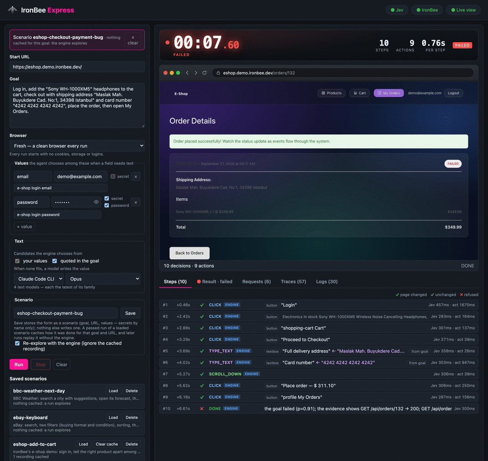
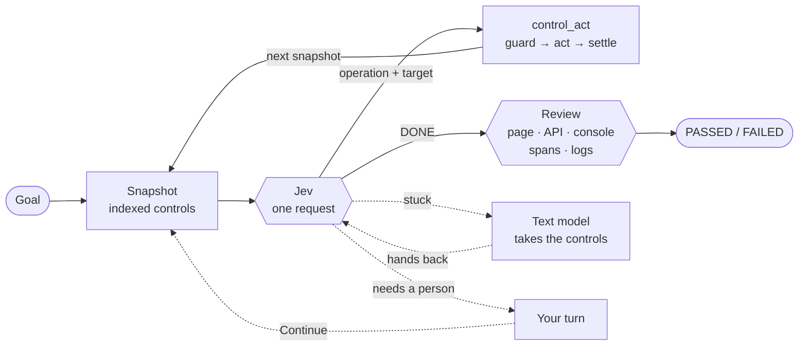
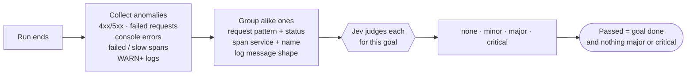

<p align="center">
  
</p>

<h1 align="center">IronBee Express</h1>

<p align="center">
  <strong>A fast, goal-driven browser agent that also checks whether your app did what the page says it did.</strong>
</p>

<p align="center">
  <a href="LICENSE"></a>
  = 22">
  
  <a href="https://docs.typesafe.ai/introduction"></a>
  <a href="https://github.com/ironbee-ai/ironbee-devtools"></a>
</p>

<p align="center">
  <a href="#quick-start">Quick start</a> ·
  <a href="#how-it-works">How it works</a> ·
  <a href="#examples">Examples</a> ·
  <a href="#documentation">Docs</a> ·
  <a href="#troubleshooting">Troubleshooting</a>
</p>

<p align="center">
  
</p>

---

IronBee Express is a goal-driven browser agent. You describe the task in one sentence, for example
"Log in, add the iPhone 15 Pro to the cart, then open the cart", and it carries it out in a real
browser. After the run it reviews what happened: the final page, the API responses and, with
[IronBee](https://ironbee.ai), the logs and traces of the backend services. You do not write
assertions.

Each step is one decision by [TypeSafe Jev](https://docs.typesafe.ai/introduction) over the page's
controls and one call to [IronBee DevTools](https://github.com/ironbee-ai/ironbee-devtools), which
performs the action and returns the next snapshot. Model output never becomes a selector, a coordinate
or a script: an action can only target a control, an option or a value that was offered.

## Why IronBee Express

- **Fast.** One engine request per step. Signing in and adding a product to the cart on IronBee's
  e-shop demo takes about 3–4 s; replaying a recorded run takes 0.3–2 s and needs no engine at all.
- **It reviews the whole run, not only the page.** If the page says "Order placed successfully!" while
  the API returns `PAYMENT_FAILED`, the run fails. Failed requests, console errors, backend spans and
  logs are reviewed against your goal.
- **Record once, replay.** A passing run of a scenario is cached and replayed without engine
  decisions. When the page changes, the engine continues from the step that no longer matches and the
  recording is updated.
- **Secrets are not shown to models.** Passwords and tokens are typed by reference; neither the engine
  nor a text model receives the value, and it is masked in everything a model sees, including when a
  page displays it.
- **Hands over to a person when needed.** For a social login, a CAPTCHA or an SMS code, the run pauses,
  the UI shows "Your turn" over the live view, and the run continues from the page you leave it on.
- **Optional text model.** A text model (Anthropic, OpenAI, OpenRouter, or the Claude Code / Codex CLI)
  can write free text, and can take the controls for a few steps when the engine is stuck.

## Quick start

You need Node.js 22+, Google Chrome, and a [TypeSafe](https://docs.typesafe.ai/introduction) API key.
The [IronBee DevTools](https://github.com/ironbee-ai/ironbee-devtools) daemon that owns the browser is
a dependency: `npm install` brings it. You do not need a separate checkout of it.

```bash
npm install
npm run build                       # the control tools the daemon loads live in dist/
echo 'TYPESAFE_API_KEY=…' > .env     # in the directory you run from, not src/
```

Web UI, with a live view of every run:

```bash
npm run dev -- ui
# → http://127.0.0.1:15986  (load an example on the left, press Run)
```

The daemon is started for you, from the `@ironbee-ai/devtools` in `node_modules`. Everything after
`--` goes to the CLI, so `npm run dev -- ui --headed` shows the browser window.

Terminal, one run:

```bash
ESHOP_PW=demo123 npm run dev -- run \
  --url https://eshop.demo.ironbee.dev/ \
  --goal 'Log in, add the "Sony WH-1000XM5" headphones to the cart, check out with shipping address "Maslak Mah. Buyukdere Cad. No:1, 34398 Istanbul" and card number "4242 4242 4242 4242", place the order, then open My Orders.' \
  --value email=demo@example.com --password password=env:ESHOP_PW
```

This checkout is expected to fail: the page reports the order as placed, but the backend did not
process it. Abridged output:

```text
  5 +3.38s ✓ TYPE_TEXT [20] textbox "Full delivery address" ← "Maslak Mah. Buyukdere Cad. No:1, 34398 Istanbul"  [p=0.96 decide 317ms act 86ms]
  6 +3.77s ✓ TYPE_TEXT [21] textbox "Card number" ← "4242 4242 4242 4242"  [p=0.94 decide 311ms act 838ms]
  …
  8 +5.34s ✓ CLICK [23] button "Place order — $ 311.10"  [p=0.98 decide 298ms act 1143ms]
  9 +6.80s ✗ DONE  [p=0.74 decide 323ms]  (the goal failed (p=0.83); the evidence shows GET /api/orders/131 → 200)

FAILED in 7.57s — 8 actions, 9 decisions (the goal failed (p=0.83); the evidence shows GET /api/orders/131 → 200)
…
FAILED — the goal was not reached: notification-service: 📧 SENDING EMAIL NOTIFICATION To: demo@example.com Subject: Order #131 Could Not Be Processed. Reason: Insufficient inventory
goal failed (p=0.74) · 1 problem in 1 anomaly reviewed
  ✗✗ CRITICAL [log] frontend: [OrderDetailPage] order ended with status FAILED: 131
```

The page says the order was placed. The order's API response and the notification service's log,
read from the IronBee trace, show that it was not, so the goal check fails the run at DONE. The
review then rates the frontend's log of the failed order as critical.

> [!TIP]
> Put the exact texts to type in quotes in the goal (`"Istanbul"`). Without a text model, Jev chooses
> only among your `--value`s, your secrets and what the goal quotes.

## How it works



Each step, Jev picks an operation and a target from the controls DevTools offers:
`CLICK` · `TYPE_TEXT` · `SELECT` · `PRESS_ENTER` · `HOVER` · `PRESS_KEY` · `GO_BACK` / `GO_FORWARD` ·
`SCROLL_DOWN` / `SCROLL_UP` · `SWITCH_TAB` / `CLOSE_TAB` · `WAIT` · `ASK_USER` · `DONE` · `BLOCKED`.
DevTools re-checks that the control is still the one Jev decided on, acts, waits for the page to
settle, and returns the next snapshot, all in one call.

Progress is measured on what the page *says*, so a click that reloads the same page counts as no
change, and the next decision is told so in plain words. `DONE` is only a claim: it is accepted when the
page and the API responses show the goal done.

## How a run is reviewed



- At DONE: do the page and the API show the goal done? If not yet, DONE is rejected and the agent keeps
  going; if the evidence shows the goal failed, the run ends failed right there.
- After the run: every anomaly is collected mechanically; whether it matters is Jev's call, for
  your goal. No text is matched against keywords. With IronBee connected, spans and logs from every
  backend service join in.

More: [review](docs/review.md).

## Record once, replay without the engine

`--save-as checkout` saves the prompt as a scenario. A passing run caches how it was done
(`./.ibexpress/cache`, never committed), and `--scenario checkout` then replays it with no engine
decisions: the checkout goes from 6.8 s explored to 1.6–1.9 s replayed. If the page changed and a
step can't be found, the engine takes over from there and the recording is healed.

More: [scenarios](docs/scenarios.md).

## Examples

Ready-to-run prompts ship in [`examples/scenarios/`](examples/scenarios). Load them in the UI or run
`ibexpress run --scenario <name>`:

| Example | Site | What it exercises |
| --- | --- | --- |
| `google-flights-round-trip` | Google Flights | autocomplete, a two-date picker, passenger count |
| `google-maps-transit` | Google Maps | suggestions, public transport, a departure time (uses a text model) |
| `ebay-keyboard` | eBay | search, two filters, sorting, the first listing |
| `ikea-office-chair` | IKEA | search, a color filter, sort by price, product details |
| `bbc-weather-next-day` | BBC Weather | a city search, its forecast, the next day |
| `eshop-add-to-cart` | IronBee e-shop demo | sign in with a secret; the right "Add to cart" among many |
| `eshop-checkout-payment-bug` | IronBee e-shop demo | a full checkout; expected to fail (the page reports success, the backend does not) |

Timings, notes and how recordings are kept: [examples](docs/examples.md).

## IronBee platform

Connect [IronBee](https://ironbee.ai) and every run becomes a session on the platform (verdict, tool
calls, video), and the run's distributed trace, from the browser through every backend service, is
read back into the review. A failed run lists the backend logs behind it. Nothing to configure: press
**Connect IronBee** in the UI (sign in or sign up, free), or reuse the login of the IronBee CLI or editor
extension. Without IronBee everything still runs; runs are just not reported.

More: [IronBee](docs/ironbee.md).

## More capabilities

<details>
<summary><b>When a person is needed</b></summary>

Some steps only the person running the test can do: a social or single sign-on login, a CAPTCHA, a code
sent to a phone, a value nothing in the run provides. Jev then chooses `ASK_USER`: the run pauses, the
UI shows *"Your turn"* over the live view and passes your clicks and typing to the browser, and
**Continue** resumes from the page you left it on. Your time is not counted as the run's. A saved
scenario records the hand-over and pauses there again on replay. From the terminal this needs
`--headed` (you act in the browser window, then press Enter). With nobody to hand over to, ASK_USER is
not offered. See [your turn](docs/web-ui.md#your-turn).
</details>

<details>
<summary><b>Where typed text comes from</b></summary>

The engine chooses a value from your `--value`s / `--secret`s (secrets by name only; each may carry
a `--value-desc` saying what it is for; a login password is given with `--password`, or marked
**password** in the UI, and is then typed into the start site's password fields only) or strings the goal
puts in quotes. When none fits, a text model you pick writes one: the Anthropic, OpenAI or OpenRouter API
(`ANTHROPIC_API_KEY`, `OPENAI_API_KEY`, `OPENROUTER_API_KEY`), or the Claude Code / Codex CLI with their
own login; `--text-model provider/model`, or the UI's model picker. See [text and secrets](docs/text-and-secrets.md).
</details>

<details>
<summary><b>Fresh browser or a saved profile</b></summary>

By default every run starts in a fresh browser: no cookies, no storage, no logins. Pick a saved
profile instead (the UI's Browser picker, `--profile name`, or a scenario's `profile`) and its cookies,
storage and logins stay between runs: sign in once and later runs start signed in. Profiles live in
`.ibexpress/profiles/` (kept out of git, since they hold live sessions); `ibexpress profiles list | delete`. A
profile needs a daemon IronBee Express starts itself, so it cannot be used with `--daemon-url`; runs in
one profile affect each other (a cart, an open session), which is why the fresh browser is the default.
</details>

<details>
<summary><b>Dialogs, new tabs and iframes</b></summary>

- **Native dialogs** (`alert` / `confirm` / `prompt`) are held for Jev to answer: the snapshot is the
  dialog, so a "Delete this?" is confirmed or cancelled on purpose. On for a daemon IronBee Express
  starts (`BROWSER_DIALOG_MODE=hold`); a `--daemon-url` daemon needs that variable itself.
- **New tabs** (`target=_blank`, `window.open`) are followed like a person would; Jev can also
  `SWITCH_TAB` / `CLOSE_TAB`. A recording continues on each tab (one video per tab). On for a daemon
  IronBee Express starts (`BROWSER_FOLLOW_NEW_TABS=true`); a `--daemon-url` daemon needs it itself.
- **Iframes** (an embedded payment or login form) with `IBEXPRESS_IFRAMES=true` (off by default). Their
  controls are offered like the page's, and the run's secrets (never a password) may be typed into
  the frames the *start site* embeds. Keep it off where the start site embeds content you don't trust.
</details>

<details>
<summary><b>Choosing the engine</b></summary>

The engine (`IBEXPRESS_ENGINE=jev`, the default and only one today) sits behind one `DecisionEngine`
interface; requests are shaped by its profile (options per question, text budget, compact
instructions), so another engine is an implementation plus a profile. See [configuration](docs/configuration.md#engine).
</details>

## Documentation

Start at the [docs index](docs/README.md), or jump straight in:

| Guide | What's in it |
| --- | --- |
| [Examples](docs/examples.md) | the shipped scenarios, timings, how to run them |
| [Configuration](docs/configuration.md) | the main settings, CLI commands and flags |
| [Web UI](docs/web-ui.md) | the run form, the live view, steps, the result and its evidence |
| [Review](docs/review.md) | how a run is judged: evidence, anomalies, verdict |
| [Scenarios](docs/scenarios.md) | save, record, replay, heal |
| [Text and secrets](docs/text-and-secrets.md) | values, secrets, text models and their providers, a text model taking over |
| [Your turn](docs/web-ui.md#your-turn) | handing the browser to a person |
| [IronBee](docs/ironbee.md) | reporting, the trace the review reads, connecting |

## Troubleshooting

<details>
<summary><b>The <code>Jev</code> pill is red, or a run stops with "is not usable"</b></summary>

```text
jev (jev-latest) is not usable: TYPESAFE_API_KEY / JEV_API_KEY is not set
```

The key was not read. `.env` is loaded from the **directory you run in**, so it belongs at the root of
your checkout — `src/.env` is never read, and a missing file is ignored silently. It is read once at
startup, so restart the UI after editing it. `export FOO=...` lines are fine. This check only reads the
configuration; it does not call the API, so "API key configured" does not mean the key is valid.
</details>

<details>
<summary><b>"The DevTools daemon exited during start"</b></summary>

```text
The DevTools daemon exited during start (code 1)
```

Run `npm run build` first, and again after you update the project. A run needs the built files in
`dist/`, and `npm run dev` does not build them.
</details>

<details>
<summary><b>A port is already in use</b></summary>

```text
listen EADDRINUSE: address already in use 127.0.0.1:15986
```

Another program, or a UI you already started, is using the port. Pick another one:
`npm run dev -- ui --port 16000`.

A run can fail the same way with `The DevTools daemon did not become healthy in time`, usually because
something else holds the daemon's port (2071 by default). Add `--port <n>` to the command.
</details>

<details>
<summary><b>A scenario asks for secrets you already gave</b></summary>

```text
Scenario checkout needs the secret(s) password (pass --secret name=… )
```

Secret values are never saved, only their names. Give them again on every run, for example
`--password password=env:ESHOP_PW` or `--secret name=…`, or fill in the secret rows in the UI.
</details>

<details>
<summary><b>A scenario explores instead of replaying, or needs the engine on every run</b></summary>

- A recording is saved only after a run of that scenario **passes** its review.
  `npm run dev -- scenarios list` shows how many recordings each scenario has.
- A recording belongs to one goal and one start URL. After you edit either, the next run explores and
  records again.
- `--explore` ignores the recording for one run.
- A site whose content changes between visits (search results, A/B tests) may need the engine on
  every replay. That is expected. `npm run dev -- scenarios clear-cache <name>` starts that scenario over.
</details>

<details>
<summary><b>The run ends BLOCKED on a login, CAPTCHA or SMS-code page</b></summary>

These steps need a person. The run hands the browser over only when someone can take it:
- always in the UI;
- in the terminal only with `--headed`: you act in the browser window, then press Enter.

Without that, the run cannot get past the page.
</details>

<details>
<summary><b>A field stays empty or gets the wrong text</b></summary>

Jev only chooses among the values you give, your secrets, and the texts your goal puts in quotes.
- Give the value with `--value name=text`.
- If the field's label does not match the name, add `--value-desc name=what-it-is-for`.
- Or put the exact text in quotes in the goal.

For free text, choose a text model: `--text-model provider/model`, or the model picker in the UI.
</details>

<details>
<summary><b>A text model is missing from the list</b></summary>

A provider appears once its key is set (`ANTHROPIC_API_KEY`, `OPENAI_API_KEY`, `OPENROUTER_API_KEY`),
or once its CLI (`claude`, `codex`) is installed, on your `PATH` and logged in. `.env` is read at
startup, so restart the UI after changing it.
</details>

<details>
<summary><b>The run was not reported to IronBee</b></summary>

- Connect first: **Connect IronBee** in the UI, from a browser on the same machine, or `ironbee login`
  with the IronBee CLI.
- A saved login is used only for its own domain (`IRONBEE_DOMAIN`, `ironbee.ai` by default).
- `IBEXPRESS_IRONBEE_REPORT=off` turns reporting off.
- When the platform rejects a send, the run still finishes. The output shows a warning with the
  reason ("NOT reported: …").
</details>

<details>
<summary><b>The run ends with <code>BUDGET</code></b></summary>

The goal needed more steps than a run allows: 60 actions and 120 decisions by default. Raise
`IBEXPRESS_MAX_ACTIONS` and `IBEXPRESS_MAX_DECISIONS` in `.env`, or split the goal into smaller ones.
</details>

## Development

```bash
npm run lint && npm test && npm run build
IBEXPRESS_E2E_DAEMON_URL=http://127.0.0.1:2099 IBEXPRESS_E2E_ENGINE=jev npx jest tests/integration/eshop   # live
IBEXPRESS_E2E_DAEMON_SCRIPT=node_modules/@ironbee-ai/devtools/dist/daemon-server.js npx jest tests/integration/control tests/integration/secrets   # live, local pages
```

## Limits

- The review is a model's judgement, so it is probabilistic. It looks at the most recent requests,
  logs and spans of a run, not at all of them.
- The agent only works with controls it can see on screen, and scrolls to reach the rest. Controls
  inside iframes are off unless you turn them on with `IBEXPRESS_IFRAMES`.
- Secrets are never shown to a model. In a few setups they are sent as a value rather than typed by
  reference; see [text and secrets](docs/text-and-secrets.md#secrets-and-passwords).

## License

[Elastic License 2.0](LICENSE) © 2026 IronBee Inc.
